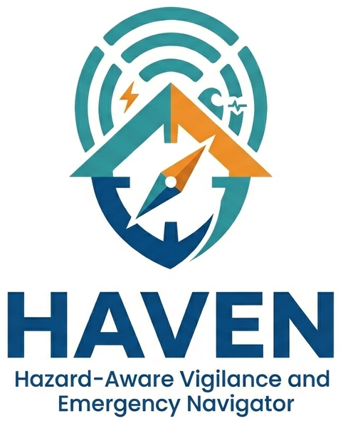

# HAVEN — Hazard-Aware Vigilance and Emergency Navigator

**HAVEN** is an end-to-end data science project that helps EU residents assess their personal emergency readiness. It monitors three independent risk signals in real-time, analyzes the user's emergency kit against EU government recommendations, and uses a RAG-powered agent to answer preparedness questions with cited guidance.



---

## Overview

In a world of increasing climate and regional volatility, HAVEN (Hazard-Aware Vigilance and Emergency Navigator) serves as a personalized safety bridge between government data and individual action. Unlike generic weather apps, HAVEN:

- Contextualizes Risk: Cross-references live weather, disaster, and health data with your specific location.

- Quantifies Readiness: Moves beyond "you should have water" to "your current water supply lasts 16 hours for your household of three."

- Provides Verifiable Answers: Uses a Retrieval-Augmented Generation (RAG) pipeline to ensure all advice is backed by EU emergency documentation.

---

## What it does

Given a location and a home emergency kit inventory, HAVEN:

- Fetches live **weather alerts** (OpenWeatherMap One Call 3.0)
- Monitors **regional disaster and crisis** activity (GDACS + ReliefWeb)
- Tracks active **EU health threats** (ECDC Communicable Disease Threats Report)
- Identifies **kit gaps** against EU government 72-hour recommendations
- Runs a **scenario simulator** — "if the power goes out for 72 hours, how long does my kit last?"
- Answers natural language questions with **cited EU guidance** via a RAG pipeline
- Surfaces a **ranked action list** that crosses all signals against kit state

---

## App Demo

**https://haven-app.streamlit.app/**

---

## Dataset

HAVEN utilizes a hybrid data strategy combining real-time API streams and a static knowledge base:

1. Real-Time Risk Streams
- Weather: OpenWeatherMap One Call 3.0 (National alerts from AEMET, SMHI, etc.).
- Regional Disasters: GDACS (Global Disaster Alert and Coordination System) RSS feeds.
- Humanitarian Crises: ReliefWeb (UN OCHA) API.
- Public Health: ECDC (European Centre for Disease Prevention and Control) weekly Communicable Disease Threats Reports.

2. RAG Knowledge Base (Vector Store)
The system is grounded in 4  EU government emergency preparedness guides:
- Belgium: Crisis Centre (crisiscenter.be)
- Netherlands: Denk Vooruit (denkvooruit.nl)
- Sweden: Krisinformation (krisinformation.se)
- Czech Republic: 72h.cz


---

## Architecture

```
┌─────────────────────────────────────────────────────────────────┐
│                          Data Sources                           │
│  OWM One Call 3.0    GDACS RSS + ReliefWeb API    ECDC CDTR     │
│  Weather + Alerts    Disasters + Crises           Health Threats│
└──────────┬──────────────────┬──────────────────────┬────────────┘
           │                  │                      │
           ▼                  ▼                      ▼
┌─────────────────────────────────────────────────────────────────┐
│              Three Independent Risk Signals (Option C)          │
│  🌤 Weather Risk 0–100   ⚔ Regional Risk 0–30   🦠 Health 0–50 │
│  (location-specific)     (location-specific)   (EU-wide)        │
│         ↓                        ↓                    ↓         │
│                  Alert Prioritizer × Kit Gaps                   │
└──────────────────────────────┬──────────────────────────────────┘
                               │
┌──────────────────────────────▼──────────────────────────────────┐
│                        RAG Pipeline                             │
│  4 EU emergency PDFs → 19 FAISS chunks (all-MiniLM-L6-v2)      │
│  HavenRetriever → HavenLLM (Groq / Ollama / Anthropic)  │
└──────────────────────────────┬──────────────────────────────────┘
                               │
┌──────────────────────────────▼──────────────────────────────────┐
│                       LangGraph Agent                           │
│                                                                 │
│  User query                                                     │
│      ↓                                                          │
│  Intent classifier  ──keyword + LLM fallback──>  5 intents     │
│      ↓                                                          │
│  Deterministic tool dispatch                                    │
│  ├── get_risk_score       → HavenSignals                        │
│  ├── get_kit_gaps         → InventoryReport                     │
│  ├── retrieve_guidelines  → top-k RAG chunks                   │
│  └── run_scenario         → survival estimate                   │
│      ↓                                                          │
│  Answer composer (LLM) → cited answer + fallback               │
└──────────────────────────────┬──────────────────────────────────┘
                               │
┌──────────────────────────────▼──────────────────────────────────┐
│                    FastAPI + Streamlit                          │
│  15 REST endpoints · APScheduler · SQLite persistence           │
│  Interactive map · Scenario simulator · Chat interface          │
└─────────────────────────────────────────────────────────────────┘
```

### Key design decisions

**Risk architecture** — three signals on different scales, never summed. Each signal has its own
scale (100 / 30 / 50), update cadence, and geographic scope. The UI displays them
as independent gauges.

**Structured routing** — the agent classifies intent with keywords
(LLM fallback for ambiguous queries), then calls tools deterministically. This is
more reliable for a safety-critical domain and easier to audit.

**Local-first RAG** — `all-MiniLM-L6-v2` runs fully locally (no API calls,
no rate limits). The FAISS index is 28 KB. LLM is the only cloud dependency, and
it is swappable via a single env var.

---

## Features

### Risk signals
| Signal | Source | Scale | Cadence |
|--------|--------|-------|---------|
| Weather | OWM One Call 3.0 (national AEMET/SMHI alerts) | 0–100 | 60 min |
| Regional | GDACS (UN/EC) + ReliefWeb (UN OCHA) | 0–30 | 7 days |
| Health | ECDC CDTR weekly bulletin | 0–50 | 7 days |

### Kit analyser
- Compares current quantities against EU 72-hour per-person recommendations
- Flags items expiring within 7 days (CRITICAL) or 30 days (WARNING)
- Scales recommendations with household size (water, food, medication, cash)

### Scenario simulator
Estimates how long the current kit covers a given emergency — not generic advice,
but calculated from the user's actual item quantities:

```
Partial kit — 72h power outage, 1 person:
  Water:  16h  (need 9L, have 2L)
  Food:   24h
  Comms:  NONE
  Meds:   MISSING
  Coverage: 26%
  First failure: hour 16

Full kit — same scenario:
  Water:  72h ✓
  Food:   72h ✓
  Comms:  OK ✓
  Meds:   OK ✓
  Coverage: 100%
```

Supported events: `power_outage` · `flood` · `earthquake` · `heat_wave` · `general`


---

## Quick start

### Prerequisites
- Python 3.11+
- Tesseract OCR (`sudo apt install tesseract-ocr` or `brew install tesseract`)
- A free [Groq API key](https://console.groq.com) for the LLM backend
- A free [OpenWeatherMap](https://openweathermap.org/api) key with One Call 3.0 activated

### Install

```bash
git clone https://github.com/ijesusjr/haven.git
cd haven
python -m venv .venv && source .venv/bin/activate
pip install -r requirements.txt
```

### Configure

Create a `.env` file:

```ini
OWM_API_KEY=your_openweathermap_key
GROQ_API_KEY=your_groq_key
LLM_BACKEND=groq

# Starting location (default: Barcelona)
LAT=41.3851
LON=2.1734
CITY=Barcelona
CITY_COUNTRY=Spain
HOUSEHOLD_SIZE=1
```

### Build the RAG index

Run the RAG notebook once to extract and embed the EU guides:

```bash
jupyter lab haven_rag.ipynb
# Run all cells — builds data/faiss/index.bin and data/faiss/chunks.json
```

### Run

```bash
# Terminal 1 — API
uvicorn api.main:app --reload

# Terminal 2 — UI
streamlit run app.py
```

Open [http://localhost:8501](http://localhost:8501).

---

## Project structure

```
haven/
├── core/
│   ├── risk_engine.py           # Weather risk scoring (OWM codes → 0-100)
│   ├── regional_risk_fetcher.py # GDACS + ReliefWeb → 0-30 score
│   ├── health_fetcher.py        # ECDC CDTR parsing → 0-50 score
│   ├── inventory_analyzer.py    # Kit gap + expiry analysis
│   ├── alert_prioritizer.py     # Cross signals × kit → ranked actions
│   └── regions.py               # Country → EU neighbours mapping
├── rag/
│   ├── chunker.py               # PDF extraction (PyMuPDF + Tesseract OCR)
│   ├── embedder.py              # all-MiniLM-L6-v2 → FAISS index
│   ├── retriever.py             # Semantic search (HavenRetriever)
│   ├── llm.py                   # Unified LLM: Ollama / Groq / Anthropic
│   └── pipeline.py              # Retriever + LLM = cited answer
├── agent/
│   ├── router.py                # Intent classifier (keyword + LLM fallback)
│   ├── tools.py                 # 4 pure tools: risk, gaps, guidelines, scenario
│   └── agent.py                 # LangGraph graph (6 nodes, closure injection)
├── api/
│   ├── main.py                  # FastAPI app (15 endpoints + APScheduler)
│   └── state.py                 # AppState singleton + SQLite persistence
├── app.py                       # Streamlit dashboard
├── data/
│   ├── pdfs/                    # 4 EU emergency preparedness guides
│   └── faiss/                   # index.bin + chunks.json (built by RAG notebook)
├── tests/                       # 145 unit tests
│   ├── test_core.py
│   ├── test_health_fetcher.py
│   └── test_regional_risk_fetcher.py
└── haven_*.ipynb                # Exploration notebooks
```

---

## LLM backends

| `LLM_BACKEND` | When to use | Model | Cost |
|---|---|---|---|
| `groq` | Free cloud deployment | Llama 3.1 8B | Free (14,400 req/day) |
| `ollama` | Local development (GPU) | Mistral 7B | Free |
| `anthropic` | Paid fallback | Claude Haiku | ~$0.25/1M tokens |

Switch with one env var — the prompt template is identical across all backends.

---

## API reference

| Method | Path | Description |
|--------|------|-------------|
| `GET` | `/` | Health check |
| `GET` | `/risk` | Three-signal risk snapshot |
| `GET` | `/kit` | Kit inventory, gaps, expiry |
| `PUT` | `/kit/{item_name}` | Update item quantity / expiry |
| `PUT` | `/household` | Set household size (rescales recommendations) |
| `GET` | `/alerts` | Prioritised action list |
| `POST` | `/chat` | Agent query → cited answer |
| `POST` | `/scenario` | Survival simulation |
| `GET` | `/refresh` | Trigger manual signal refresh |
| `PUT` | `/location` | Update location (triggers weather + regional refresh) |

---


## Data sources

| Source | What it provides | Auth |
|--------|-----------------|------|
| [OpenWeatherMap One Call 3.0](https://openweathermap.org/api/one-call-3) | Current conditions + national alerts | Free key (1,000 calls/day) |
| [GDACS](https://www.gdacs.org/rss.aspx) | Natural disaster alerts (RSS, no auth) | None |
| [ReliefWeb](https://reliefweb.int/help/api) | Humanitarian crisis reports (REST API) | None (1,000 calls/day) |
| [ECDC CDTR](https://www.ecdc.europa.eu/en/publications-and-data/communicable-disease-threats-report) | Weekly disease threats | None (public HTML) |
| [NL Guidelines](https://english.denkvooruit.nl/documents/2025/11/25/putting-together-an-emergency-kit) | RAG knowledge base | None (public HTML) |
| [CZ Guidelines](https://www.72h.gov.cz/en/emergency-supplies) | RAG knowledge base | None (public HTML) |
| [BE Guidelines](https://crisiscenter.be/en/what-can-you-do/build-emergency-kit/emergency-kit-home#:~:text=The%20European%20Union%20recommends%20having%20an%20emergency,or%20matches%20*%20Candles%20or%20tea%20lights) | RAG knowledge base | None (public HTML) |
| [SE Guidelines](https://www.mcf.se/en/advice-for-individuals/home-preparedness--prepping-for-at-least-a-week/basics-of-home-emergency-preparedness/#:~:text=Radio%20powered%20by%20batteries%2C%20solar,%2C%20emergency%20services%2C%20energy%20provider.) | RAG knowledge base | None (public HTML) |


